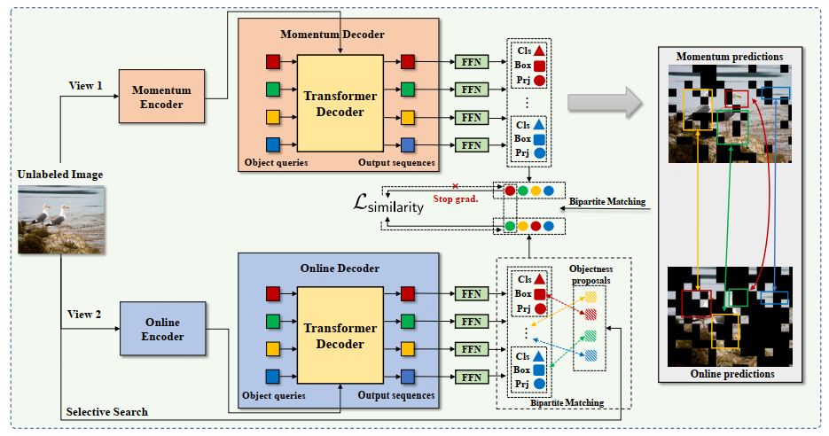
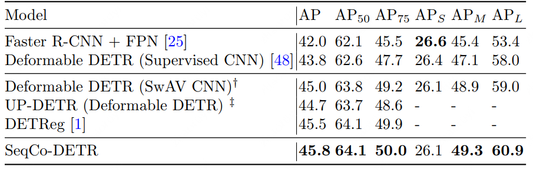
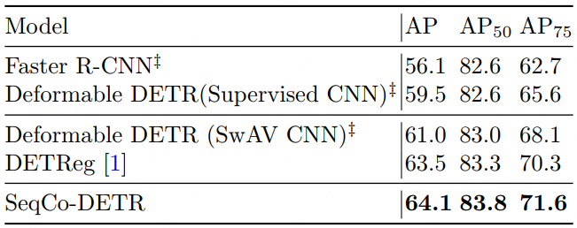
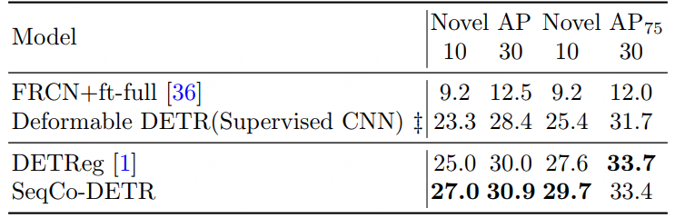

# SeqCo-DETR: Sequence Consistency Training for Self-Supervised Object Detection with Transformers
This is the implementation of the paper **SeqCo-DETR: Sequence Consistency Training
for Self-Supervised Object Detection with Transformers**.

Paper is under review, code is under preparation, please be patient.

## Keywords 
+ Self-supervised learning 
+ Object detection
+ Sequence consistency
+ Detection with transformers

## Method
 

## Results
#### Table 1: Comparison of detection results fine-tuned on MS COCO train2017 and evaluated on val2017.

  
  <h3 align="center">Result in COCO</h3> 

#### Table 2: Comparison of detection results fine-tuned on PASCAL VOC trainval07+12 and evaluated on test07.
 

#### Table 3: Comparison results on few-shot detection task on COCO, evaluated on the novel classes. 
 
 
 
 
 
 